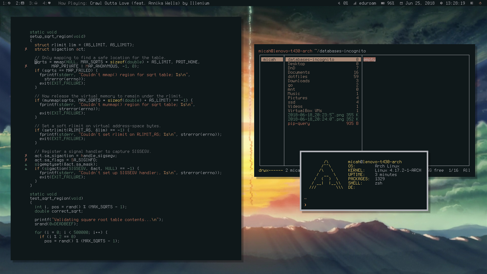

I’m an undergraduate **computer science** major with a focus in **system architecture**
and **theory** at the **Georgia Institute of Technology** in Atlanta, Georgia.

# About Me

I have been interested in computer science since I was six years old, and have
built up an unmatched passion for the field. I have extensive experience in
software development and research from internships, projects, and competitions.
I am currently a full-time student at the Georgia Institute of Technology’s
College of Computing as a computer science major with a focus in system
architecture and theory, and am working part-time as a Student Research
Assistant at the Georgia Tech Research Institute.

[LinkedIn](https://www.linkedin.com/in/mehalter){.btn .btn-primary}
[GitLab](https://gitlab.com/mehalter){.btn .btn-primary}
[My DNA](promethease.html){.btn .btn-primary}

### Contact Details

Micah Halter

Atlanta, GA

704-490-9840

[micah@mehalter.com](mailto:micah@mehalter.com)

[532C 083C 2D6A 4752 46F1 8639 E10C 6AE7 BF5B
1D1F](https://a.sks.jda.mn/pks/lookup?search=0xe10c6ae7bf5b1d1f&fingerprint=on&exact=on&op=vindex)

[Printable CV](resume.pdf){.btn .btn-primary}
[Man Page](micah.1.html){.btn .btn-primary}

# Education

## Georgia Institute of Technology

*B.S. Computer Science* • Fall 2015 - anticipating graduation in Spring 2019

- I was included in the Dean’s List in the following semesters: Fall 2015, Spring
  2016, Fall 2016, Fall 2018.
- I have taken classes such as Data Structures & Algorithms, Objects and Design,
  Computer Organization & Programming, Systems & Networks, Operating System
  Design, Algorithm Design & Analysis, and Compilers & Interpreters.

## Hong Kong University of Science and Technology

*B.S. Computer Science* • Fall 2017

- I studied abroad in Hong Kong for the Fall semester of 2017.
- I traveled around Japan and China to experience and learn about other cultures.
- I took Operating Systems, Algorithm Design, and Number Theory.

## North Carolina School of Science and Mathematics

*High School Diploma* • Fall 2013 - Spring 2015

- I have taken AP Computer Science I & II, Advanced Programming, Data
  Structures, and more.
- I received the annual computer science department award of academic
  achievement.

# Work Experience

## Kindred Spirits Atlanta, LLC

*Co-Owner and Bartender* • December 2018 - Present

- Cater events with bartending and mixology services.
- Create curated cocktail menus for events with innovative and complex recipes
  to meet the needs of all event attendees.
- Engage with customers and provide outstanding service and hospitality to build
  customer relations and increase company value.
- Maintain and file all necessary legal documents to ensure legitimacy of the
  business.

## Georgia Tech Research Institute

*Student Research Assistant* • January 2016 - Present

- I have been developing and researching a new data model for handling and
  analyzing sonar data.
- I have developed, deployed, and manage a web application hosting this new data
  model.
- I researched and implemented a crime forecasting system using Python and
  PostgreSQL.
- I worked on the development of a wearable technology based 911 communication
  assistance tool.
- I worked on the research and development of a parallel, distributed stream
  processing library using functional programming in Scala.

## The Boeing Company

*System Architect Intern* • May 2017 - August 2017

- I developed a security auditing tool suite for Red Hat Enterprise Linux 7
  using Bash.
- I helped with the developed a web-based data visualization tool using HTML5,
  C#, and SQL Server.
- I developed several perl scripts as needed by team members.

## The Boeing Company

*IT Intern* • May 2016 - August 2016

- I documented and executed an upgrade plan for the company's identity
  management servers.
- I developed an Outlook-integrated conference room mapping tool.
- I designed and began development of a web-based Kanban board tool.
- I developed an in-house analytics tool to manage which types of employees are
  accessing certain sites.

## North Carolina School of Science and Mathematics

*Teaching Assistant* • August 2014 - June 2015

- I tutored students who needed help in the AP Computer Science I and II
  classes.
- I assisted the computer science professors with anything they needed, such as
  looking over assessments before they were given.

## North Carolina State University College of Textiles

*Research Intern* • June 2014 - July 2014

- I participated in an engineering research internship at North Carolina State
  University's College of Textiles under the Advanced Self-Powered Systems of
  Integrated Sensors and Technologies (ASSIST) Program. The ASSIST Program
  conducts research on wearable technology that harvests energy from the human
  body instead of a battery or other source of electricity.
- The company Porticos came to the ASSIST program at NC State looking for a few
  students to conduct some research on their new product the Porticool. The
  Porticool is a cooling vest that regulates the body temperature of people who
  work in environments of high temperatures. The company wanted us to look into
  integrating a self-powered electronic system into the vest that could
  potentially power various sensors. We used thermoelectric generators to create
  a current from the temperature difference between the vest and the body.
- We looked into what sensors we could possibly power, along with what sensors
  we would want to power. We wanted to integrate different sensors into the vest
  depending on the desired use of the vest. In a situation like a fire fighter,
  we may include sensors like a heart rate monitor, air quality sensor, and some
  sort of indoor location mechanism. These sensors would be working together to
  make the firefighter's job safer, ensure their safety, and regulate their body
  temperature in the harsh environment.

# Skills

- Linux System Administration
- Languages
    - C, C++
    - Go
    - Python
    - Shell script
    - Java
    - C#
    - SQL, MySQL, PostgreSQL
    - HTML5, CSS3
    - JavaScript
    - LaTeX

# Projects

## Linux Configuration

*January, 2017 - Present*

I have been working on a vim-based linux set up to optimize my workflow on my
computer. My current workflow includes tools like a tiling window manager
(i3-gaps), the vim text editor, command line interface applications, and many
custom scripts to automate tasks I do a lot.

[GitLab Repository](https://gitlab.com/mehalter/dotfiles)

## Clean Water Crowdsourcing

*September, 2016 - November, 2016*

This is was a team project for the Objects & Design class at the Georgia
Institute of Technology. This project allowed us to go through the entire
development process from design to implementation of a full Java based
application. It allowed us to learn good development practices to make sure code
is concise, maintainable, and sharable.

[GitLab Repository](https://gitlab.com/mehalter/Clean-Water-Crowdsourcing)

## Huffman Coding

*May, 2015*

Wrote a C based implementation of the Huffman compression algorithm for a final
project in my Data Structures I class.

[GitLab Repository](https://gitlab.com/mehalter/Huffman-Coding-C)

## Verificia

*August, 2014 - April, 2015*

Designed a new password entry method to protect against key-loggers,
mouse-trackers, and screenshot-grabbers.

Programmed and deployed a working prototype website as a proof of concept.
Pitched the idea through a business portfolio and an oral presentation to
investors and judges.

Achieved finalist status in the competition and am recognized as a Pete Conrad
Summit Diplomat.

## Multi-Player Conway's Game of Life

*February, 2015*

Wrote a Java based version of Conway’s Game of Life for a final project in AP
Computer Science class and Introductory Complex Systems class.

Added new rules to this famous cellular-automata to introduce competition into
the cellular world.

[GitLab Repository](https://gitlab.com/mehalter/Multiplayer-Game-of-Life)
